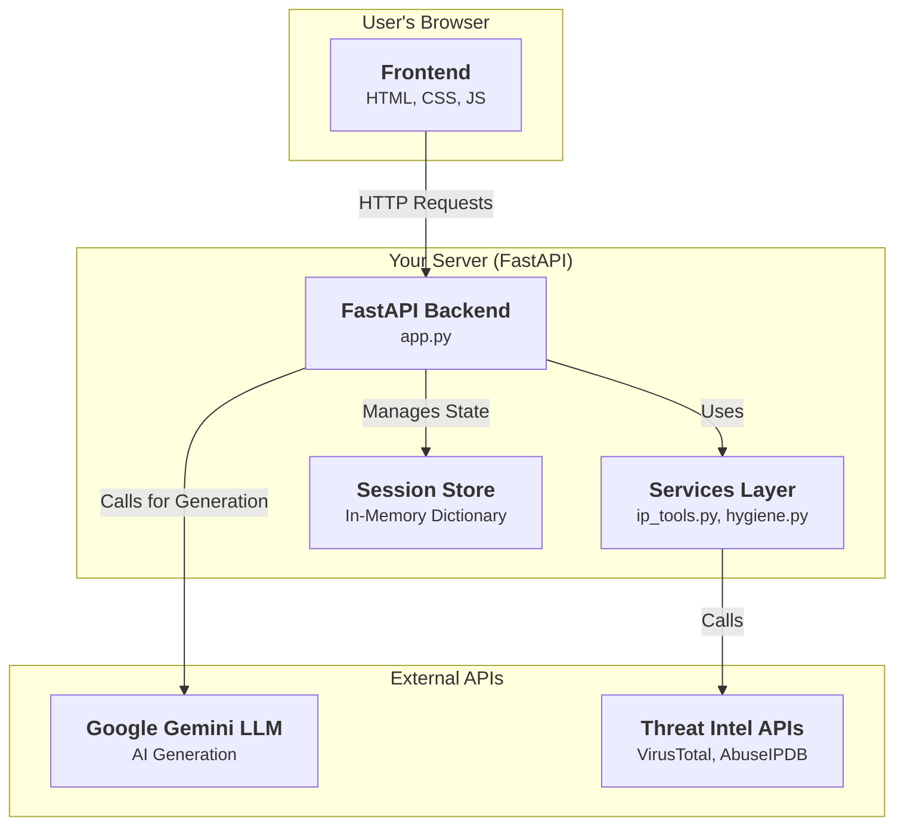
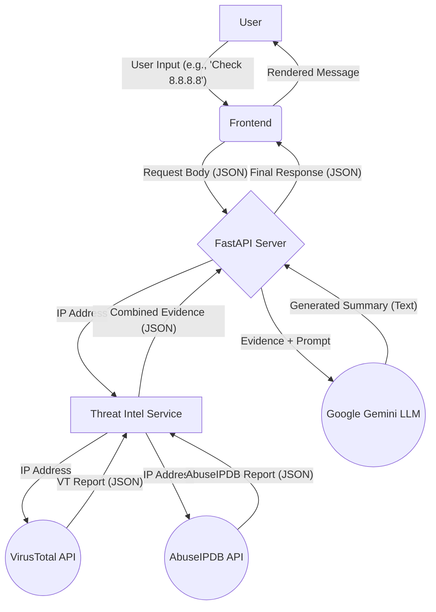

# CybVector: AI-Powered Cybersecurity Assistant


**CybVector** is a web-based, AI-powered chatbot designed to act as a personal cybersecurity analyst. It leverages Google's Gemini large language model to provide real-time threat analysis, security hygiene assessments, and expert advice on cybersecurity best practices.


The application features a modern, dark-themed "Analyst's Terminal" interface and integrates with external APIs like **VirusTotal** and **AbuseIPDB** to enrich its analysis with live threat intelligence data.


## Features

* **🤖 Conversational AI:** Natural language interface powered by Google's `gemini-1.5-flash` model.
* **🔎 Real-Time Threat Analysis:** Enter an IP, domain, or URL to get a security verdict based on data from VirusTotal and AbuseIPDB.
* **🛡️ Interactive Security Hygiene Check:** An interactive quiz that assesses a user's security posture and provides a score and actionable feedback.
* **🧠 Intelligent Questioning:** The bot can answer clarifying questions mid-quiz without losing its place, creating a more natural conversational flow.
* **✨ Modern Frontend:** A clean, professional, and responsive "Analyst's Terminal" interface built with HTML, CSS, and vanilla JavaScript.
* **🐍 Robust Backend:** Built with the high-performance **FastAPI** Python framework.

---

## Technology Stack

* **Backend:** Python, FastAPI
* **Frontend:** HTML, CSS, Vanilla JavaScript
* **AI Model:** Google Gemini (`gemini-1.5-flash-latest`)
* **External APIs:** VirusTotal, AbuseIPDB
* **Libraries:** `google-generativeai`, `requests`, `python-dotenv`, `uvicorn`

---

## Flow Diagram 



---

## Setup and Installation

Follow these steps to get the application running locally.

### Prerequisites

* Python 3.8+
* An active virtual environment (recommended)
* API keys for:
    * Google AI (Gemini)
    * VirusTotal
    * AbuseIPDB

### Installation

1.  **Clone the repository:**
    ```bash
    git clone [https://github.com/your-username/CybVector.git](https://github.com/your-username/CybVector.git)
    cd CybVector
    ```

2.  **Install Python dependencies:**
    ```bash
    pip install fastapi uvicorn python-dotenv requests google-generativeai
    ```

3.  **Create and configure the `.env` file:**
    Create a file named `.env` in the root of the project directory and add your API keys. **Ensure there are no spaces before or after the `=` sign and no typos in the key names.**

    ```text
    GEMINI_API_KEY="YOUR_GEMINI_API_KEY_HERE"
    VIRUSTOTAL_API_KEY="YOUR_VIRUSTOTAL_API_KEY_HERE"
    ABUSEIPDB_API_KEY="YOUR_ABUSEIPDB_API_KEY_HERE"
    ```

4.  **Run the application:**
    Use `uvicorn` to start the server. The `--reload` flag will automatically restart the server when you make changes to the code.

    ```bash
    uvicorn app:app --reload
    ```

5.  **Open the application:**
    Navigate to **`http://127.0.0.1:8000`** in your web browser.

---

## Project Structure

The project is organized into a clean and maintainable structure.

```/cybvector-project
├── .env
├── app.py
├── services/
│   ├── __init__.py
│   ├── hygiene.py
│   └── ip_tools.py
├── static/
│   ├── css/
│   │   └── style.css
│   └── js/
│       └── app.js
└── templates/
    └── index.html
```
